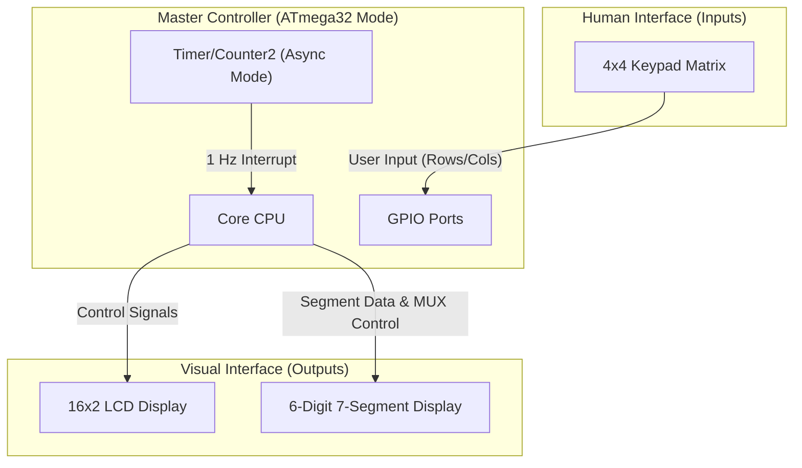
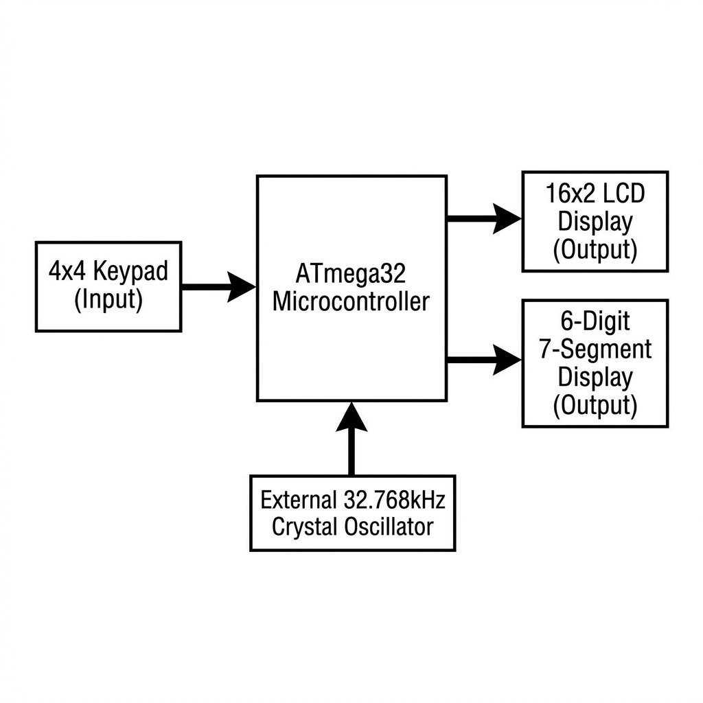
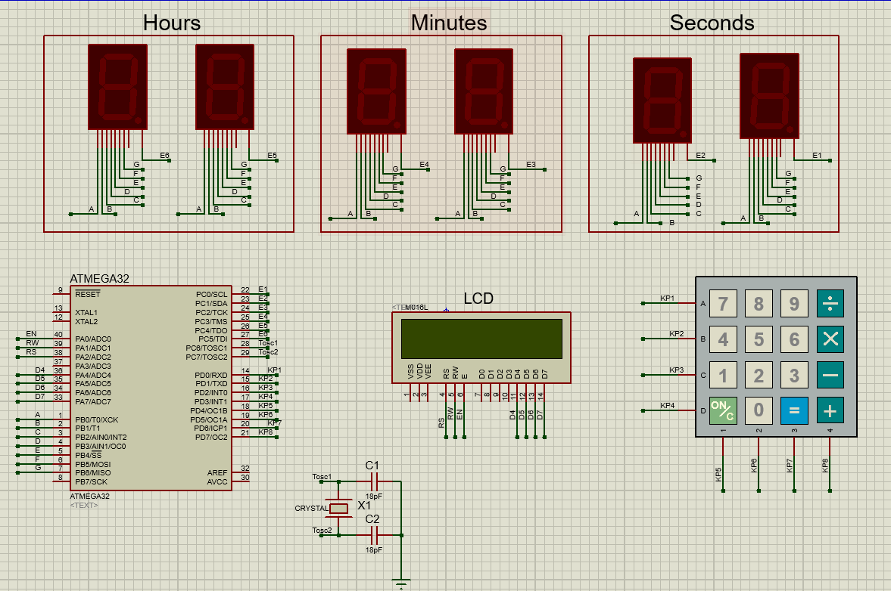

# 🕒 Real Time Clock (RTC) System

<div align="center">

      

</div>

---

## 📑 Table of Contents

- [Project Overview](#-project-overview)
- [System Architecture & Block Diagram Analysis](#-system-architecture--block-diagram-analysis)
- [Deep System Logic & Technical Insight](#-deep-system-logic--technical-insight)
- [Hardware Components](#-hardware-components)
- [Folder Structure](#-folder-structure)
- [Simulation & Usage](#-simulation--usage)
- [How to Build & Run](#-how-to-build--run)
- [Features](#-features)
- [Drivers & Technical Documentation](#-drivers--technical-documentation)
  - [Drivers Summary](#drivers-summary-table)
  - [DIO Driver (MCAL)](#-dio-driver)
  - [Timer Driver (MCAL)](#-timer-driver)
  - [LCD Driver (HAL)](#-lcd-driver)
  - [Keypad Driver (HAL)](#-keypad-driver)
  - [Seven Segment Driver (HAL)](#-seven-segment-driver)
- [Future Improvements](#-future-improvements)
- [Author](#-author)

---

## 📖 Project Overview

The **Real Time Clock (RTC)** is `Real-Time Embedded System` designed to maintain and display accurate time in both 12-hour and 24-hour formats. Built on the **ATmega32** microcontroller, this project was **designed, developed, and completed in December 2024** as a robust portfolio demonstration. The system interfaces with a Keypad for user input, an LCD for configuration, and a multiplexed Seven Segment Display for real-time viewing.

The project is built upon a **comprehensive ATmega32 MCAL/HAL Driver Library**, designed with modularity and portability in mind to allow for rapid application development.

### ❓ Problem Statement

Standard microcontroller timers can drift over time, and basic clock implementations often lack user-friendly interfaces for configuration. This project solves these issues by implementing a precise interrupt-based timekeeping mechanism coupled with an intuitive user interface for on-the-fly adjustments.

### 💡 Why this is useful

- **Educational Value**: Demonstrates layered architecture (HAL/MCAL/APP).
- **Practical Application**: Can be used as a standalone digital clock module.
- **Reference Design**: Serves as a template for multiplexing displays and handling state machines in C.

---

## 🏗 System Architecture & Block Diagram Analysis

The software follows a strict **Layered Architecture** approach, separating hardware-specific register manipulations (MCAL) from platform-independent component logic (HAL) and business logic (APP).

### 🧩 System Block Diagram




*(Figure 1: System Block Diagram)*

### 🧬 Component Roles & Interaction

* **Master Node (ATmega32)**: The central processing unit. It orchestrates all operations.
  * **Main Application (`APP`)**: Handles the high-level state machine (Configuration vs. Running modes). It polls the Keypad for user intent and drives the 7-segment display logic.
  * **Timekeeping Engine (`Timer2`)**: Acts as an independent "heartbeat". Configured in **Asynchronous Mode** with an external 32.768kHz crystal, it generates a precise interrupt every 1 second. This decoupled design ensures time accuracy regardless of the main application's processing load.

* **Input Devices (Sensors)**:
  * **Keypad (HAL)**: Acts as the primary command interface. The CPU scans the matrix to detect key presses for setting time and changing modes.

* **Output Devices (Actuators)**:
  * **LCD (HAL)**: Provides textual feedback during the configuration phase (e.g., "Set Hours", "Choose Mode"). It acts as a slave receiving command and character data packets.
  * **Six-Digit 7-Segment Display (HAL)**: The primary runtime display. It is driven using a **Time Division Multiplexing (TDM)** strategy, where the CPU rapidly switches between digits (persistence of vision) to display `HH:MM:SS`.

---

## 🧠 Deep System Logic & Technical Insight

This section details the internal workflow, timing constraints, and state management of the system.

### 🔄 System Workflow & State Machine

The application is designed as a sequential state machine with a concurrent interrupt-based background task.

#### 1. Initialization Phase

* **Power Up**: System starts, clocks stabilize.
* **Driver Init**: LCD (4-bit mode), Keypad (Pull-ups), and 7-Segment ports are initialized.
* **Timer2 Setup**: Critical step. Timer2 is configured in **Normal Mode** with `AS2` set (Asynchronous Clock).
  * *Clock Source*: 32.768kHz External Crystal.
  * *Prescaler*: 128.
  * *Overflow Rate*: $32,768 \text{ Hz} / 128 / 256 = 1.0 \text{ Hz}$.
  * **Result**: Precise 1-second interrupts.

#### 2. Configuration State (Blocking)

* The system enters a blocking loop requiring user interaction.
* **Step 1**: Select Format (12H vs 24H).
* **Step 2**: If 12H, Select AM/PM.
* **Step 3**: Input Start Time (Hours -> Minutes -> Seconds).
* *Validation*: All inputs are checked against valid ranges (e.g., Hours must be 0-23). Invalid inputs trigger a retry prompt.

#### 3. Running State (The "Super Loop")

* Once configured, the system enters an infinite `while(1)` loop.
* **Multiplexing Logic**: The CPU writes the segment data (`PORTB`) and activates the corresponding digit enable line (`PORTC`) sequentially.
  * **Delay Strategy**: `_delay_ms(2)` is used per digit.
  * **Frame Rate**: 6 digits * 2ms = 12ms per frame (~83 Hz refresh rate). This eliminates flicker.
* **Reset Check**: Logic polls the Keypad for a '0' press to break the loop and return to the Configuration State.

#### 4. Background Timekeeping (ISR)

* The `ISR(TIMER2_OVF_vect)` executes every second, totally independent of the main loop.
* **Logic**:
  1. Increment `seconds_counter`.
  2. Check Overflow (60s -> 1m, 60m -> 1h).
  3. Handle Day Rollover (12/24h limits).
* *Concurrency Note*: The ISR updates `volatile` global variables which the Main Loop reads for display.

### 📡 Communication Protocol Logic

#### Master (AVR) → Slave (LCD)

The LCD uses a **4-bit Parallel Protocol** to save I/O pins.

* **Command Frame**:
  1. **High Nibble**: Send bits 4-7 of command.
  2. **Latch**: Pulse `EN` pin (High -> Low).
  3. **Low Nibble**: Send bits 0-3 of command.
  4. **Latch**: Pulse `EN` pin.
* **Control/Data**: The `RS` pin distinguishes between Commands (`RS=0`) and Data (`RS=1`).

---

## 🔌 Hardware Components

### Pin Mapping Table

| Module    | Pin Name   | ATmega32 Port | Pin Index | Direction | Note                        |
| :-------- | :--------- | :------------ | :-------- | :-------- | :-------------------------- |
| **LCD**   | **RS**     | PORT A        | PA2       | Output    | Register Select             |
| **LCD**   | **RW**     | PORT A        | PA1       | Output    | Read/Write (usually GND)    |
| **LCD**   | **EN**     | PORT A        | PA0       | Output    | Enable Latch                |
| **LCD**   | **D4-D7**  | PORT A        | PA4-PA7   | Output    | 4-bit Data Bus              |
| **Keypad**| **R0-R3**  | PORT D        | PD0-PD3   | Output    | Row Drivers                 |
| **Keypad**| **C0-C3**  | PORT D        | PD4-PD7   | Input     | Column Inputs (Pull-up)     |
| **7-Seg** | **a-g, dp**| PORT B        | PB0-PB7   | Output    | Segment Data (Common Bus)   |
| **7-Seg** | **EN0-EN5**| PORT C        | PC0-PC5   | Output    | Digit Select (Multiplexing) |
| **Clock** | **TOSC1/2**| PORT C        | PC6/PC7   | Input     | **32.768kHz Crystal**       |


*(Figure 2: Proteus Simulation Schematic)*

### Assumptions & Constraints

1. **Clock Frequency**: The system F_CPU is defined as **8MHz**. Changing this requires recalculating `_delay_ms` but does **not** affect timekeeping (driven by external crystal).
2. **Crystal Requirement**: A 32.768kHz watch crystal MUST be connected to pins `TOSC1` and `TOSC2` for the clock to run.
3. **Blocking Configuration**: The clock continues to run in the background during configuration, but the display is frozen on the "Set Time" menus.

---

## 📂 Folder Structure

The project directory is structured for clarity and separation of concerns:

```bash
/RealTimeClock
├── /APP                  # Main Application Layer
│   └── RealTimeClock.c   # entry point, state machines, ISR
├── /HAL                  # Hardware Abstraction Layer
│   ├── /Keypad           # Driver for 4x4 Input Matrix
│   ├── /LCD              # Driver for 16x2 Display
│   └── /SevenSegment     # Driver for Multiplexed LED Displays
├── /MCAL                 # Microcontroller Abstraction Layer
│   ├── /DIO              # Low-level Digital I/O Control
│   └── /Timer            # Hardware Timer configurations
└── /LIB                  # Common Utilities
    ├── std_macros.h      # Bit manipulation macros
    └── std_types.h       # Standardized C types
```

---

## ⚡ Simulation & Usage

This project is verified using **Proteus ISIS**.

### How to Run Simulation:

1. Open the Proteus design file (if available in root or `simulation` folder).
2. Ensure the ATmega32 component path points to the compiled `.hex` file.
3. **Critical**: Set the ATmega32 **Clock Frequency** to **8MHz**.
4. Run the simulation. You should see the LCD prompting for mode selection.

### User Interaction Loop

| Mode            | Input     | Output (7-Seg) | Note            |
| --------------- | --------- | -------------- | --------------- |
| **12H**         | Set 13:00 | `01:00:00`     | LCD shows "PM"  |
| **24H**         | Set 13:00 | `13:00:00`     | Standard format |
| **Reset**       | Press '0' | System Resets  | Re-enter config |

---

## 🛠 How to Build & Run

### Prerequisites

* **Microchip Studio** (formerly Atmel Studio) or **avr-gcc** toolchain.
* **AVRDUDE** (for flashing).

### Build Steps

1. Open the solution `RealTimeClock.atsln` in Microchip Studio.
2. Select **Release** or **Debug** configuration.
3. Press **F7** to Build Solution.
4. Verify that `RealTimeClock.hex` is generated in the `Debug/` or `Release/` folder.

### Flashing Code

Using a strictly compatible programmer (e.g., USBasp):

```bash
avrdude -c usbasp -p m32 -U flash:w:RealTimeClock.hex
```

---

## ✨ Features

### System Features

* ✅ **High Precision**: Decoupled asynchronous timer logic using external 32.768kHz crystal.
* ✅ **Dual Mode Support**: Toggle between 12-hour (AM/PM) and 24-hour formats.
* ✅ **Visual Output**: 6-Digit multiplexed display for clear visibility.
* ✅ **Input Validation**: Prevents invalid time entries (e.g., entering 25 hours).

---

## 🗂 Drivers & Technical Documentation

This section details the reusable drivers developed for this project.

### Drivers Summary Table

| Layer | Driver Name | Status | Description | Link |
| :---: | :---: | :---: | :--- | :---: |
| **MCAL** | DIO | ✅ Stable | Digital Input/Output control. | [Jump](#-dio-driver) |
| **MCAL** | Timer | ✅ Stable | Timer0/Timer2 hardware timers. | [Jump](#-timer-driver) |
| **HAL** | LCD | ✅ Stable | Character LCD (16x2) control. | [Jump](#-lcd-driver) |
| **HAL** | Keypad | ✅ Stable | 3x3 or 4x4 Matrix Keypad scanning. | [Jump](#-keypad-driver) |
| **HAL** | SevenSegment | ✅ Stable | 7-Segment Display control. | [Jump](#-seven-segment-driver) |

---

### 🔵 DIO Driver

**Layer:** MCAL (Microcontroller Abstraction Layer)
**Folder:** [📂 View Code](./MCAL/DIO)

#### 📝 Overview

The Digital Input/Output (DIO) driver allows control over the ATmega32's General Purpose I/O pins. It supports setting pin directions, writing logic levels, reading input states, and managing internal pull-up resistors.

#### 🔧 Features

- Set Pin/Port Direction (Input/Output).
- Write Pin/Port Values (High/Low).
- Read Pin/Port Status.
- Toggle Pin state.
- Enable/Disable Internal Pull-ups.
- High/Low Nibble manipulation.

#### 🧩 Public APIs

| Function Name | Description | Parameters |
| :--- | :--- | :--- |
| `DIO_vsetPINDir` | Configures a pin as Input (0) or Output (1). | `port`, `pin`, `dir` |
| `DIO_write` | Writes logical 1 or 0 to a pin. | `port`, `pin`, `value` |
| `DIO_u8read` | Reads the logic level of a pin. | `port`, `pin` |
| `DIO_toggle` | Toggles the state of a specific pin. | `port`, `pin` |
| `DIO_set_port_direction` | Sets direction for the entire port (8 pins). | `port`, `dir` |
| `DIO_write_port` | Writes a byte value to the port. | `port`, `value` |
| `DIO_vconnectpullup` | Activates internal pull-up resistor. | `port`, `pin`, `enable` |

#### 🚀 Example Usage

```c
#include "MCAL/DIO/DIO.h"

int main(void) {
    DIO_vsetPINDir('A', 0, 1); // Set Port A Pin 0 as Output
    DIO_write('A', 0, 1);      // Set Port A Pin 0 High
    while(1);
}
```

---

### 🔵 Timer Driver

**Layer:** MCAL (Microcontroller Abstraction Layer)
**Folder:** [📂 View Code](./MCAL/Timer)

#### 📝 Overview

The Timer driver provides interfaces to configure the ATmega32's hardware timers (Timer0 and Timer2). It abstracts the register settings required for Overflow Interrupts, CTC Mode, and PWM generation.

#### 🔧 Features

- **Timer2 Overflow**: Interrupt-based timing (Normal Mode).
- **Timer0 CTC**: Clear Timer on Compare Match functionality.
- **Wave Generation**: Non-PWM, Fast PWM, and Phase Correct PWM modes on OC0.

#### 🧩 Public APIs

| Function Name | Description |
| :--- | :--- |
| `timer2_overflow_init_interrupt` | Initializes Timer2 in Normal Mode with Overflow Interrupt enabled. |
| `timer_CTC_init_interrupt` | Initializes Timer0 in CTC Mode with interrupts. |
| `timer_wave_fastPWM` | Configures Timer0 to generate Fast PWM signal on OC0. |
| `timer_wave_phasecorrectPWM` | Configures Timer0 for Phase Correct PWM. |

#### ⚠️ Notes

- Ensure global interrupts (`sei()`) are enabled in the application layer when using interrupt-based functions.

---

### 🟢 LCD Driver

**Layer:** HAL (Hardware Abstraction Layer)
**Folder:** [📂 View Code](./HAL/LCD)

#### 📝 Overview

The LCD driver provides a simple interface for standard character LCDs (like HD44780). It supports both 4-bit and 8-bit modes of operation, allowing flexible pin usage.

#### 🔧 Features

- **Dual Modes**: Support for 4-bit and 8-bit data interfaces.
- **Cursor Control**: Move cursor to specific Row/Column.
- **Content Management**: Send Characters, Strings, Commands, and Clear Screen.

#### 🛠 Configuration

Configuration is managed in `LCD_config.h`:
- Define `#define four_bits_mode` or `#define eight_bits_mode`.

#### 🧩 Public APIs

| Function Name | Description | Parameters |
| :--- | :--- | :--- |
| `LCD_vInit` | Initializes the LCD hardware based on selected mode. | `void` |
| `LCD_vSend_char` | Displays a single character. | `char` |
| `LCD_vSend_string` | Displays a null-terminated string. | `char*` |
| `LCD_movecursor` | Moves cursor to specified coordinates. | `row` (1-2), `col` (1-16) |
| `LCD_clearscreen` | Wipes all content from display. | `void` |

---

### 🟢 Keypad Driver

**Layer:** HAL (Hardware Abstraction Layer)
**Folder:** [📂 View Code](./HAL/Keypad)

#### 📝 Overview

The Keypad driver scans a matrix keypad (typically 4x4) to detect button presses. It uses a row-scanning algorithm to identify which key is actively pressed.

#### 🔧 Features

- **Matrix Scanning**: Efficient reading of rows and columns.
- **Debouncing**: Logic assumes hardware or App-level timing (implicit).
- **Standard Mapping**: Default mapping for `0-9`, `A-D`, `*`, `#`.

#### 🧩 Public APIs

| Function Name | Description | Returns |
| :--- | :--- | :--- |
| `keypad_vInit` | Sets up DIO pins (Rows as Output, Cols as Input Pull-up). | `void` |
| `keypad_u8check_press` | Scans the matrix and returns the pressed char. | `char` (or `NOTPRESSED`) |

#### 🚀 Example Usage

```c
char key = keypad_u8check_press();
if (key != 0xFF) {
    LCD_vSend_char(key);
}
```

---

### 🟢 Seven Segment Driver

**Layer:** HAL (Hardware Abstraction Layer)
**Folder:** [📂 View Code](./HAL/SevenSegment)

#### 📝 Overview

A driver to interface with 7-Segment LED displays (Common Anode/Cathode). It handles the conversion of numeric values (0-9) to their corresponding segment bit-masks.

#### 🔧 Features

- **Port-Based Control**: Takes a full port to drive the 7 segments + decimal point.
- **Look-Up Table**: Fast conversion of numbers to segment patterns.

#### 🧩 Public APIs

| Function Name | Description | Parameters |
| :--- | :--- | :--- |
| `seven_seg_vinit` | Configures the specified port as Output. | `port` |
| `seven_seg_write` | Writes a digit (0-9) to the display port. | `port`, `number` |

---

## 🚀 Future Improvements

* [ ] Add **DS1307 RTC Module** support for battery backup and persistent timekeeping.
* [ ] Implementation of an **Alarm** function with buzzer output.
* [ ] Add **Date** display (Day/Month/Year).

---

## ⚖️ License

This project is open-source and available under the **MIT License**.

---

## 👨‍💻 Author

**Abdelrahman Arafa**

📧 **Email:** [engarafa55@gmail.com](mailto:engarafa55@gmail.com)

> "Feel free to use, modify, and share this project. For any questions or collaboration, contact me anytime."

---
